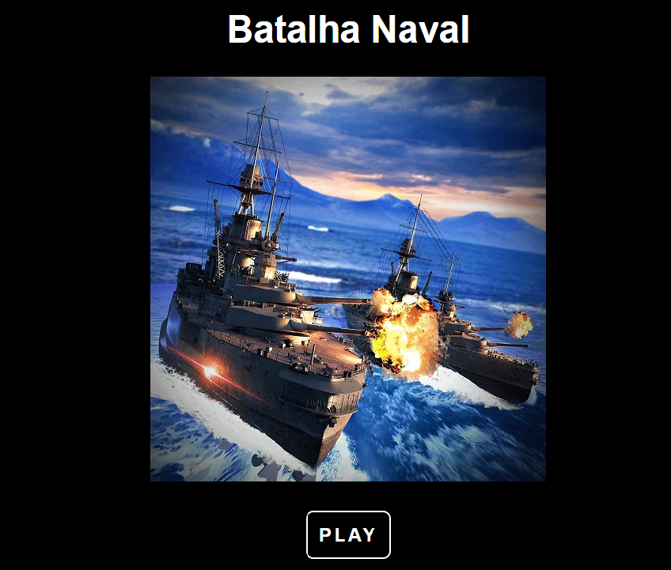

# Batalha Naval
Um jogo de Batalha Naval construindo em HTML, CSS, E JAVASCRIPT, com auxílio do livro Use A Cabeça JavaScript, adicionando melhorias na parte visual.

<a href="https://jromarioss.github.io/batalha_naval/" target="_blan">Link para jogar o jogo</a>

## Como baixar o jogo
1 - Clique no icone em verde CODE

2 - DOWNLOAD ZIP

3 - Depois extrai o arquivo.

4 - Inicio o arquivo index.html

## Como Jogar
1 - Clicar no Botão Play.

2 - No canto inferior direito, no campo em verde digite a posição que deseja atirar.

3 - Escolha a posição exemplo " A5 " e clique em ATIRAR!

4 - Se aparecer o navio você acertou, caso apareça um MISS, você errou.

5 - acertando 3 navios você vence a partida.

